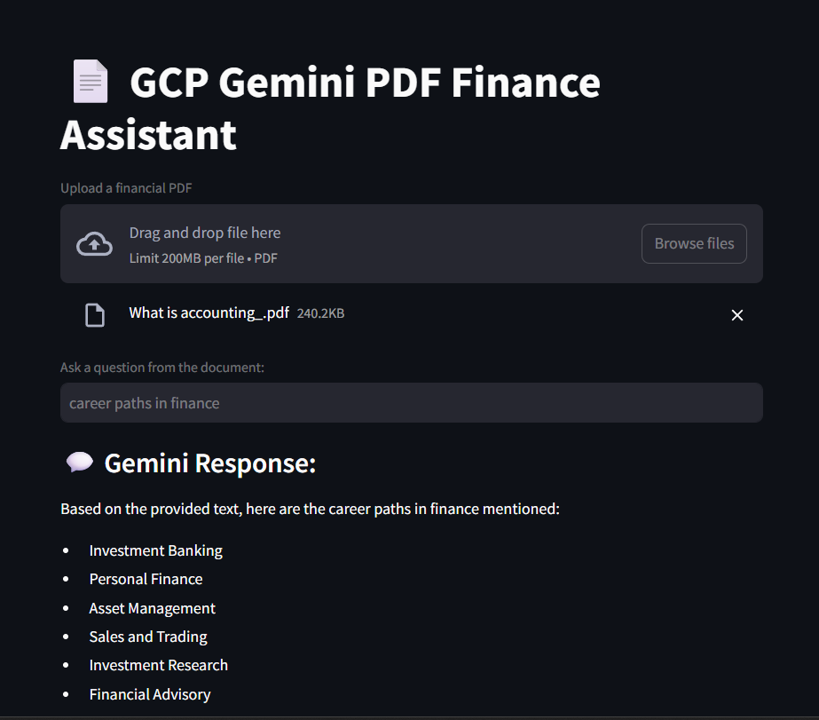

## 📄 GCP Finance Chatbot

A Streamlit-based chatbot that uses Google Cloud’s Gemini embedding model and generative AI to answer questions about financial PDFs.

---

### 🖼 UI Preview



---

## 🔍 Features

- **PDF Upload**: Upload any financial PDF file through the web interface.  
- **Text Chunking**: Automatically splits the PDF text into manageable chunks.  
- **Embeddings**: Uses Google Cloud Vertex AI’s Gemini embedding model (`gemini-embedding-001`).  
- **Retrieval**: Performs cosine-similarity search over embedded chunks.  
- **Generative Answers**: Feeds the top-K relevant chunks as context to Gemini-2.0-flash for an answer.

---

## 🚀 Getting Started

### 1. Clone the repository

```bash
git clone https://github.com/shemayon/gcp-finance-chatbot.git
cd gcp-finance-chatbot
````

### 2. Create & activate a Python environment

```bash
python3 -m venv .venv
source .venv/bin/activate    # Linux/Mac
.venv\Scripts\activate       # Windows PowerShell
```

### 3. Install dependencies

```bash
pip install -r requirements.txt
```

### 4. Setup environment variables

Create a `.env` file in the project root (or export directly):

```ini
GEMINI_API_KEY=<your Gemini API key>
GCP_PROJECT_ID=<your GCP project ID>
GCP_LOCATION=us-central1
```

> **Note:** You must have Vertex AI enabled in your GCP project and proper IAM permissions.

### 5. Run the app

```bash
streamlit run main.py
```

Open your browser at `http://localhost:8501` to interact.

---

## 🗂 Directory Structure

```
├── main.py               # Streamlit application entrypoint
├── UI.png                # Screenshot used in README and demo
├── requirements.txt      # Python dependencies
└── utils
    ├── embedding_utils.py  # Functions for calling Gemini embedding endpoint
    └── search_utils.py     # Cosine-similarity search helper
```

---

## ⚙️ Configuration

* **Embedding Model**: `gemini-embedding-001`
* **Generative Model**: `gemini-2.0-flash`
* **Batch Size**: Adjust in `embed_text_chunks`
* **Chunk Size**: Set `max_chunk_size` in `load_pdf_text_chunks`

---

## 🤝 Contributing

Feel free to open issues or submit pull requests for new features, bug fixes, or documentation improvements.

---

